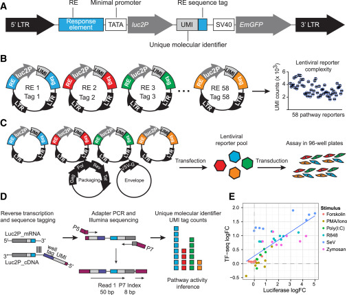
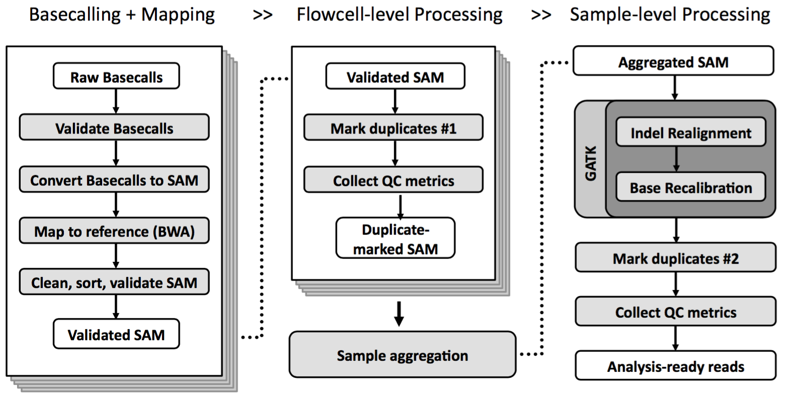
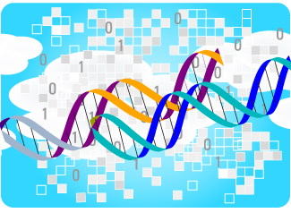

I worked at the [Broad Institute of MIT and Harvard](http://broadinstitute.org) from May 2014 to December 2015. My projects varied from supporting new assay development in the [Xavier lab](https://ccib.mgh.harvard.edu/xavier/pi_bio) to petabyte-scale sequencing in the [Genomics Platform](http://genomics.broadinstitute.org).

### RNA SEQ AND PATHWAY ANALYSIS

Ramnik Xavier’s lab aims to understand the functional basis of autoimmune disorders such as Crohn’s disease and Type 1 diabetes. Their approach utilizes RNA sequencing and other assays to study gene expression and pathway activity in immune cells.

I developed a pipeline for quantifying gene expression and gene set enrichment from 3' RNA sequencing data produced by the Xavier lab. I also contributed to an analysis pipeline for the novel TF-Seq assay, which involves introducing viral vectors containing pathway-specific response elements (with identifying barcodes) into a cell population, such that pathway activation induces transcription of the corresponding viral insert. This work was [recently published in Cell Systems](http://dx.doi.org/10.1016/j.cels.2016.04.011).

### OPEN SOURCE BIOINFORMATICS

[Picard](http://broadinstitute.github.io/picard) and [HTSJDK](http://samtools.github.io/htsjdk) are open-source Java toolkits for manipulating high-throughput sequencing data formats (such as BAM and VCF). Picard also provides many useful tools for collecting metrics and doing quality control, such as marking PCR duplicates. Along with the Genome Analysis Toolkit (GATK), they form the computational backbone of the Broad Institute’s sequencing platform.

I helped maintain the Picard and HTSJDK code bases, fixing bugs and adding new analysis capabilities. My biggest contribution was writing a tool to measure the incidence of [sequencing errors masquerading as low allele fraction SNPs](http://nar.oxfordjournals.org/content/41/6/e67), by testing the significance of technical factors like read 1 / read 2 bias. Identifying these errors (which are often caused by oxidative damage during sample prep) is essential for avoiding false positives in somatic variant calling. I also integrated my tool into our production pipeline, allowing the lab to quickly notice these artifacts and correlate them with sample prep techniques.

I also [gave a talk](https://www.youtube.com/watch?v=AfG8vjmxIsc) about Picard’s duplicate marking tool at the March 2015 BroadE workshop on GATK best practices.

### GENOMES ON THE CLOUD

The Broad Genomics Platform produces [over 20 terabytes of sequence data every day](https://research.googleblog.com/2016/04/genomic-data-processing-on-google-cloud.html), and local storage / compute resources can’t keep up. I worked on a project to move the bulk of our genome analysis pipelines from local compute to cloud-based platforms such as Google Compute Engine. For example, I contributed to a pipeline for rapid processing and quality control of sequencing runs to check for serious errors (e.g. sample swaps, low read mapping rates) before sending data to the cloud for further analysis.

I also worked on [FireCloud](https://software.broadinstitute.org/firecloud), a cloud-based platform that allows researchers to explore data from The Cancer Genome Atlas (TCGA) as well as upload their own datasets, define and run analysis workflows, and manage data access within user-defined workspaces. I mostly worked on the workspace / database backend, which is under active development on [GitHub](https://github.com/broadinstitute/rawls).
