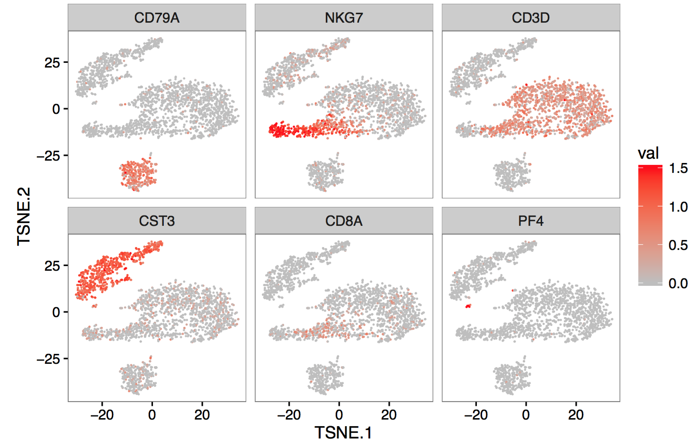

I worked at [10X Genomics](http://www.10xgenomics.com) from January 2016 to August 2017. My projects spanned both RNA sequencing and whole genome / exome sequencing using the 10X molecular barcoding platform.

For IP reasons, I cannot provide full details about my work at 10X, but here's an overview.

### SCALING SINGLE CELL TRANSCRIPTOMICS

Single-cell RNA sequencing is a powerful way to profile the gene expression of large, heterogeneous cell populations. The 10X instrument allows capture and unique barcoding of tens of thousands of cells in one instrument run, using a simpler workflow than most existing protocols.

The logical next step is to pool even more cells, across multiple instrument and sequencing runs, in order to increase signal and detect even rarer subpopulations. I developed pipelines to support these sorts of large-scale experiments. Among other things, this required optimizing existing algorithms for clustering and dimensionality reduction to allow analysis of an unprecedented number of cells at once. My work can be found in the [Cell Ranger](https://support.10xgenomics.com/single-cell-gene-expression/software/pipelines/latest/what-is-cell-ranger) software package.

### PHASING LONG MOLECULES

The 10X platform can also be used for DNA sequencing. Instead of single cells, the sample is partitioned into long molecules (up to ~100KB), which are used to produce short reads with a barcode denoting the molecule of origin. The barcodes allow downstream analyses to "link" reads together according to their source molecules. Linked reads provide useful long-range information that can disambiguate between homologous regions and enable haplotype phasing across large chunks of chromosomes.

I made significant contributions to the development of [Long Ranger](http://support.10xgenomics.com/genome-exome/software/pipelines/latest/what-is-long-ranger), a toolkit for analyzing 10X genome and exome data. I also contributed to assay design and QC for new applications of the technology, such as a custom exome bait set that utilizes linked reads to improve phasing of genes.
